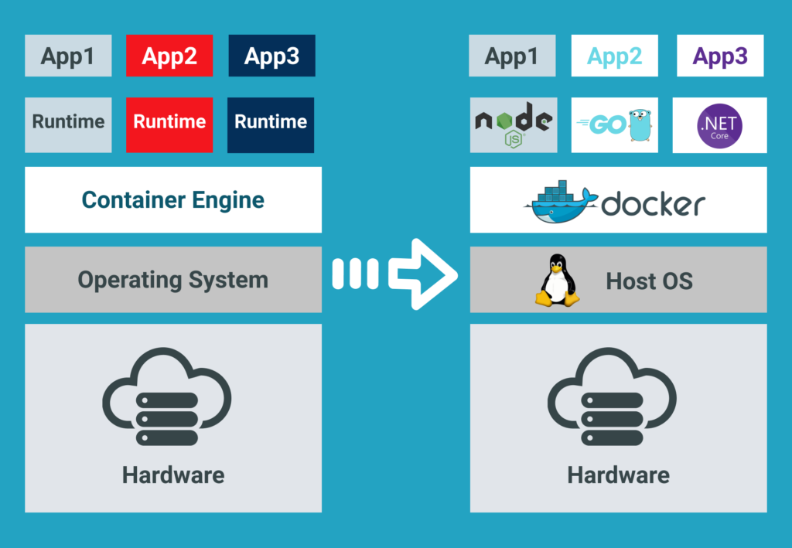

# 도커 세미나 자료

## 기본 개념

> 도커(Docker) 란 무엇이고 왜 사용해야 할까?

### 도커의 정의

위키피디아에서 제공하는 도커의 정의는 다음과 같다.

> 도커는 리눅스의 응용 프로그램들을 **프로세스 격리 기술**들을 사용해 **컨테이너**로 실행하고 관리하는 오픈소스 프로젝트이다.



- 컨테이너라는 단위로 OS 레벨의 가상화 구조
- 각 컨테이너는 독립적인 환경에서 실행시킨다.
- Host OS의 영향을 받지 않고 실행이 가능하다.

> 도커를 공부하기 전 도커의 기반이 되는 기술인 **LXC(Linux Container)**에 대해 알아야 한다.

**_컨테이너?_**

- 컨테이너의 개념은 리눅스의 내장된 LXC(LinuX Container) 기술로부터 처음 소개됨.
- LXC는 단일 머신상 여러 개의 독립된 리눅스 커널 컨테이너를 실행하기 위한 OS레벨의 가상화 개념.

**_프로세스 격리 기술?_**

- 리눅스 네임스페이스(Linux namespace)
  - 리눅스의 리소스 접근을 제어하기 위해 사용되는 기능.
  - 리소스 별로 IPC, 마운트, 네트워크, PID, 사용자, UIS 등 여러 리소스를 기준으로 리소스를 격리시키고 분리할 수 있게 해준다.
- Chroot
  - 컨테이너는 별도의 실행 환경을 가지고 있는데, 이때 사용되는 기술인 루트 디렉토리 격리 기술이다.
  - 프로세스가 바라보는 루트 디렉토리를 파일 시스템상의 특정한 디렉토리로 변경할 수 있게 한다.
- 컨트롤 그룹 (Cgroups)
  - 프로세스에서 사용가능한 CPU, 메모리, 네트워크 대역폭, 디스크 I/O 등을 그룹 단위로 제어하는 리눅스 커널의 기능.
- 리눅스 캐퍼빌리티(Linux capabilities)
  - 프로세스의 권한을 제어하는 기능
- 유니온 마운트(Union Mount)
  - 계층화된 파일 시스템을 구현

**정리**

_도커는 리눅스의 여러 기술을 활용해서 컨테이너 단위로 격리시키는 여러 기술들을 활용해 우리의 프로세스를 가상화 시킬 수 있다._

> \*\*도커를 왜 사용해야 할까?

cf)\*\* ”java 개발자들은 jvm만 있으면 어디든지 실행 가능한데 굳이 Docker를 써야 하나요?”

>

도커의 장점 중 하나는 높은 이식성(portability) 입니다. 이는 jvm도 비슷한 특성을 갖고 있습니다. 그렇기 때문에 spring boot 사용하는 개발자 중에서 혹시 안써도 되지 않을까? 라는 생각이 들기도 합니다(저도 비슷한 의문이 있었습니다)

- 실제 서버를 운용하고 Spring Boot 서버를 배포한다고 해보자.
  - 가장 먼저 고민해야 할 점은 배포 서버의 환경을 구축해야 한다.
  - 먼저 구축하기 위해 애플리케이션과 맞는 Java를 설치하고 만약 DB가 있다면 DB를 셋팅해야 한다(혹은 클라우드 데이터베이스를 셋팅한다)
  - 만약 필요한 환경 변수가 있다면 셋팅하고, 원하는 property값을 셋팅할 수 있게 처리하고 어떤 OS든 JVM만 있다면 실행할 수 있게 된다.
- 만약 트래픽이 증가해 더 성능이 좋은 서버 환경에서 실행을 해야 한다면?
  - 다른 서버를 구축하고 위에서 작업한 것을 다시 설정해줘야 한다.
- 만약 레거시 프로젝트가 있어서 다른 서버는 낮은 자바 버전을 실행해야 한다면?
  - 다른 Java 를 설치하고 구동 시켜야 한다.
- 스케일 아웃을 위해서 여러 서버를 구동시켜야 한다면 ?
  - 스케일 아웃을 위한 서버를 다시 구축하거나 외부 시스템의 힘들 빌린다 (Ex, aws AMI etc..)

**도커를 사용하게 된다면?**

- 실제 서버를 운용하고 Spring Boot 서버를 배포한다고 해보자.
  - 도커 파일에 코드로 명시해준다.
  - Java 버전, 필요한 환경 변수, DB 등
- 만약 트래픽이 증가해 더 성능이 좋은 서버 환경에서 실행을 해야 한다면?
  - 같은 도커 파일기반으로 실행시킨다.
- 만약 레거시 프로젝트가 있어서 다른 서버는 낮은 자바 버전을 실행해야 한다면?
  - 도커 파일에 Java 버전만 바꿔준다.
- 스케일 아웃을 위해서 여러 서버를 구동시켜야 한다면 ?
  - 컨테이너 오케스트레이션으로 처리 한다(ex k8s)

정리)

실제 서버를 배포하기 위해서 고려해야 하는 부분은 다양하고 끊임없이 바뀝니다. 이 부분은 여러 서드파티 라이브러리를 통해 대응이 가능할 수 있지만, 도커 기반의 환경으로 셋팅한다면, 코드 레벨로 관리하면 쉽게 변경 가능하고, 이는 도커는 환경 구축 시점이 도커 이미지를 만드는 시점이기 때문에 상대적으로 자유롭게 변경 가능합니다.

읽어보면 좋은 글

- [https://www.44bits.io/ko/post/why-should-i-use-docker-container](https://www.44bits.io/ko/post/why-should-i-use-docker-container)

## 도커 시스템 구조 컨테이너와 이미지

- 도커 정보 확인하기

```json
docker info
```

- 도커를 설치하면 도커 클라이언트(CLI)와 도커 서버(데몬)으로 구성된다.

**도커 컨테이너를 만들려면 도커 이미지(image) 라는게 필요하다.**

### 도커 이미지란?

- 코드, 런타임, 시스템 도구, 시스템 라이브러리 및 설정과 같은 응용 프로그램을 실행하는 데 필요한 모든 것을 포함하는 가볍고 독립적이며 실행 가능한 `소프트웨어 패키지`.
- 즉 패키지를 이용해 표준 단위를 만든다 ⇒ 이미지를 이용해 컨테이너를 만든다.
- 클래스와 인스턴스의 관계라고 이해해도 됨.

**도커를 사용할때 흐름**

**예제) docker run hello-world라는 명령어를 실행해보자**

```json
docker run hello-world
```

```json
inhyeokjo  ~  docker run hello-world                                                                             ✔
Unable to find image 'hello-world:latest' locally
latest: Pulling from library/hello-world
719385e32844: Pull complete
Digest: sha256:a13ec89cdf897b3e551bd9f89d499db6ff3a7f44c5b9eb8bca40da20eb4ea1fa
Status: Downloaded newer image for hello-world:latest

Hello from Docker!
This message shows that your installation appears to be working correctly.

To generate this message, Docker took the following steps:
 1. The Docker client contacted the Docker daemon.
 2. The Docker daemon pulled the "hello-world" image from the Docker Hub.
    (amd64)
 3. The Docker daemon created a new container from that image which runs the
    executable that produces the output you are currently reading.
 4. The Docker daemon streamed that output to the Docker client, which sent it
    to your terminal.

To try something more ambitious, you can run an Ubuntu container with:
 $ docker run -it ubuntu bash

Share images, automate workflows, and more with a free Docker ID:
 https://hub.docker.com/

For more examples and ideas, visit:
 https://docs.docker.com/get-started/
```

1. 도커 클라이언트에서 명령어를 입력하면 클라이언트에서 도커 서버로 요청을 보낸다
2. 서버에서 hello-world 라는 이미지가 로컬에 이미 다운로도 돼 있는지 확인한다.
3. 기존에 내려받은 hello-world 라는 이미지가 없기 때문에 `Unable to find image 'hello-world:latest' locally` 라는 문구가 출력.
4. 도커 이미지가 저장된 도커 허브(Docker Hub)에서 hello-world 이미지를 가져오고 로컬에 보관
5. hello-world 이미지가 있으니 이미지를 이용해서 컨테이너 생성
6. 생성된 컨테이너는 이미지를 받은 설정이나 조건에 따라 프로그램을 실행함.


1. 이미지 다운받아 보기

```docker
docker pull nginx:latest
```


- docker pull 명령어를 통해 이미지를 도커 허브에서 다운받을 수 있다.

### 실습- 도커 파일 만들고 이미지 빌드하기

준비)

1. 스프링 부트 프로젝트 하나 만들기.


1. 터미널에서 build 실행

```json
./gradlew build
```


- build후 jar 파일이 생성된것을 확인할 수 있다.

```docker
FROM openjdk:17-oracle

WORKDIR app

ARG JAV_FILE=./build/libs/dockerdemo-0.0.1-SNAPSHOT.jar

COPY ${JAV_FILE} app.jar

EXPOSE 8080

ENTRYPOINT ["java","-jar","app.jar"]
```

1. 터미널에서 도커 파일을 기반으로 도커 이미지 만들기

```docker
docker build -t springimage .
-t 옵션: 이미지에 이름 지정
```

- 빌드 결과물 확인하기

```docker
inhyeokjo  ~/Documents/2023-project/dockerdemo  docker images                                                                                                                                                                                                      ✔
REPOSITORY    TAG    IMAGE ID       CREATED         SIZE
springimage  latest  2e0c78514005   5 seconds ago   489MB
```

1. 이미지를 기반으로 컨테이너 실행하기

```docker
docker run -d -p 8080:8080 2e0c78514005 or(이름 지정 가능)
-d : 백그라운드 실행
-p : 포트 맵핑하기
```


> **무슨일이 일어난걸까?**


- 컨테이너들은 앞서 말한 Linux의 기술을 기반으로 커널(OS)를 공유하며, 컨테이너가 실행중임.


- 도커 이미지에 있는 파일 스냅숏을 컨테이너의 디스크로 옮겨준다(물리적 이동X 논리적 격리)
- 이후 이미지를 실행할 명령어도 옮겨준다.
- 이후 컨테이너에서 애플리케이션을 지정한 명령어로 실행시킨다.

### 도커 이미지 분석하기

**도커 파일 명령어 설명**

FROM

- 이미지 생성시 기반이 되는 이미지 레이어 명시, <이미지 이름>:<태그> 형식으로 작성
- 태그를 붙이지 않으면 자동으로 가장 최선 버전 내려받음.

WORKDIR

- 애플리케이션 디렉토리 생성

RUN

- 도커 이미지가 생성되기 전에 수행할 셸 명령어

CMD or ENTRYPOINT

- 컨테이너가 시작할 때 실행할 명령어

**추가로 알아보기) run vs cmd vs entrypoint**

[https://www.bmc.com/blogs/docker-cmd-vs-entrypoint/](https://www.bmc.com/blogs/docker-cmd-vs-entrypoint/)

- 다른 명령어도 있습니다.

---

이미지에 대해서 자세하게 알아보기

[https://www.44bits.io/ko/post/how-docker-image-work](https://www.44bits.io/ko/post/how-docker-image-work)

### 실습 - 도커 허브 올리기

1. 터미널에서 도커 허브 로그인 하기

```docker
docker login

inhyeokjo  ~/Documents/2023-project/dockerdemo  docker login                                                                                                                                                                                                     1 ↵
Login with your Docker ID to push and pull images from Docker Hub. If you don't have a Docker ID, head over to https://hub.docker.com to create one.
Username: dls3145
Password:
Login Succeeded

Logging in with your password grants your terminal complete access to your account.
For better security, log in with a limited-privilege personal access token. Learn more at https://docs.docker.com/go/access-tokens/
```

**도커 이미지 이름**

도커 이미지는 기본적으로 [저장소 이름]/[이미지이름]:[태그] 로 구성돼 있다.

**저장소(Repository)** 이름 : 이미지가 저장된 장소, 이름이 명시되지 않은 이미지는 도커에서 기본적으로 제공하는 이미지 저장소인 도커 허브의 공식 이미지를 뜻한다.(이미지를 생성시 저장소 이름을 명시할 필요는 없으므로 생략하는 경우도 있음)

**이미지이름**: 해당 이미지가 어떤 역할을 하는지 나타냄, 생략할 수 없으며 반드시 설정해야 함.

**태그** : 이미지의 버전 관리 혹은 리비전(Revision)관리에 사용. 태그를 생략하면 도커 엔진은 이미지의 태그를 latest로 인식함.

**이미지 다시 빌드**

```docker
docker build -t dls3145/dockerspring:0.1 .
docker build -t [계정이름]/[이미지이름]:[태그] .
```

**이미지 도커 허브에 올리기**

```docker
docker push dls3145/dockerpsring:0.1
```


### 실습 - ec2에 배포하기

- ec2에 배포하기는 생략..
- 대신 로컬에서 테스트 해보자

기존 이미지 삭제

```docker
docker rmi dls3145/dockerspring:0.1
```

```docker
docker run -d -p 8080:8080 --name spring dls3145/dockerspring:0.1
```
